::: tip 介绍
react native桥接原生
:::

<!-- more -->


#### Lottery项目的学习


#####  项目的整个章节


- 星球中， 有相应的 简历上的东西， 可以进行一个参考， 及时的总结


- 每一节 学习的过程中， 都要去思考哪些点，是可以写在简历上面， 这些点思考的怎么回答
  - 基于xxx 实现了xxx ，带来了什么效益


###### 学习标兵  (做完之后, 可以看下, 这个人的, 看一下, 哪些点, 可能自己考虑还不是很全面!)

[知识星球 | 深度连接铁杆粉丝，运营高品质社群，知识变现的工具 (zsxq.com)](https://wx.zsxq.com/dweb2/index/footprint/218245124458811)


[知识星球 | 深度连接铁杆粉丝，运营高品质社群，知识变现的工具 (zsxq.com)](https://wx.zsxq.com/dweb2/index/footprint/212552581881181)


##### 项目的结构


- lottery

  - domain
    - 领域层（非常重要的一层）
  - application
    - 对领域层的接口进行一个包装
  - interfaces
    - 管理我们的一个配置文件， 和application 的一个启动
  - infrastructure
    - 基础数据库层面的服务（数据仓库）
    - 比如连接 mysql ， redis
  - common
  - rpc

  

大致的依赖图！

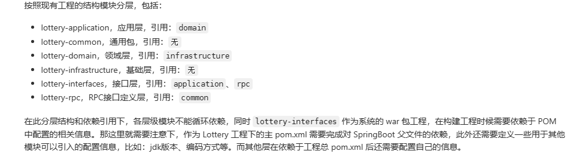


##### 第三节 跑通 rpc  广播模式过程调用


###### 这一节 需要 前置知识 dubbo 的学习


###### dubbo 引申的出来的知识


== 1.

- 通过黑马的 dubbo 的视频 ，了解了 ， 单体架构， 集群 架构，  分布式架构，SOA ， 以及 微服务架构
- 集群架构， 多台 机器干同样的事情， 
- 分布式架构， 多台 机器干不同的 事情， 最终构成一个完整的事情， （这里的 多台机器， 每台机器又可以搭建集群！）

dubbo 的 入门demo  可以直接去官网， 上面有很详细的 入门 demo， 非常详细

 

-  现在 又出现了一个问题就是， lottery 和 dubbo 的入门案例， 明显不太一样
- 三方， 服务的提供者， 服务的消费者， 通用 接口所在的那一方！

等到后面再去理解这一点


== 2.

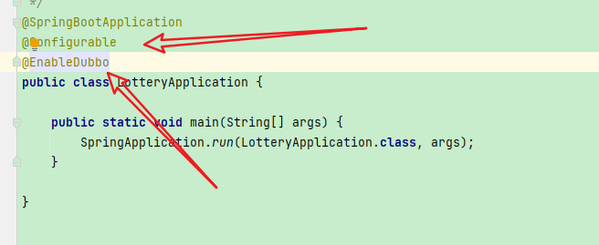

这个 是在 lottery-interfaces包下的


- lottery-rpc 可以看成是 lottery-interfaces 抽出来的一个 接口层嘛


== 3. 

目前 没有使用 dubbo 进行 rpc 调用 是可以 跑通的

因为这里是直接依赖, 插入数据 和查找数据 是没有任何问题的!


== 4. 有个报错的点, 但是并没有 影响程序的执行! (有点奇怪!)

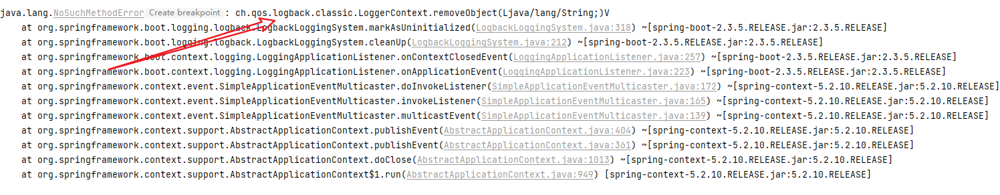


== 5.

lottery-test 这个工程模块并没有跑通

失败了, 各种错误!


== 6. 终于 把 lottery-test  rpc 给 跑通了, 卧槽, 我服了 

1. dubbo  技术不熟练
2. 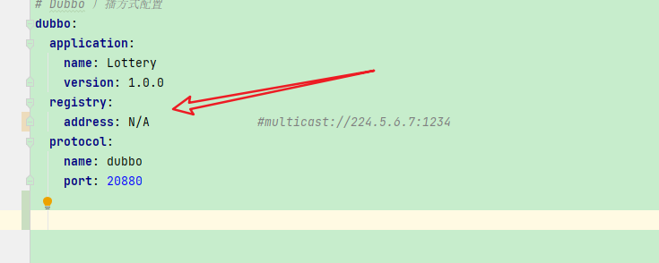

3. 这里采用的是直 连, 并没有使用任何的 ,注册中心, 可以使用 zookeeper, 或者  multicast 虚拟的注册中心, 后面肯定 是要使用注册中心的
4. 其实也没有修改多少东西, 就稀里糊涂的跑通
5. 跑不通之前,发现都快要被折磨死了, 跑通之后, 卧槽牛逼!
6. gitcode 一些 issue 中, 也有一些类似的问题
7. 下回遇到此类问题, 不要着急, 慢慢来, 或者先缓 一下,再 整, 说不定就解决了!


---

**一些配置  尽量和 小傅哥保持一致, 代码中的细节可以按照自己的一个 编程的经验,没必要全都按照 他写的来做!**


**一些小的收获git的使用**  , 远程没有分支, 怎么把 本地分支 提交到远程仓库

[(92条消息) 【Git】git提交代码到指定分支（远程已有分支和远程没有分支）图文并茂、详细步骤说明_git 提交分支_小树ぅ的博客-CSDN博客](https://blog.csdn.net/qq_44624536/article/details/119378542)


你对git 的熟悉, 还只是个皮毛!


###### 既然你写 了dubbo ，那就需要可 聊， 也就是dubbo 的面试的内容 （而不是简单的会用）

duboo 常见的面试题， 要可聊

- dubbo 的直连 模式
- dubbo的注册中心模式(一般使用 zookeeper, 也可以使用 redis (这个还没使用过呢),  nacos 作为注册中心 )


##### 第四节 抽奖活动策略表的设计


- 这一节, 主要是 把 ,表的设计这一块, 给整 明白!
-  如果实在 理解不透的话， 可以先去， 看一下星球中， 别人的理解


- 第三节中 rpc 测试的时候的一个  activity 表 , 一起整一下, 给整明白!


#####  第五节抽奖策略领域模块设计和开发


- 目前 在 抽奖策略领域模块这里， 好像展示了， 一点点这个 DDD 领域驱动的缺点
  -  **类创建的是不是太多了！ （res ， req 等等之类的 这些类的 开销， 是不是非常大， 细分之后， 肯定也有细分之后的缺点！）**


=1. MVC  to DDD  

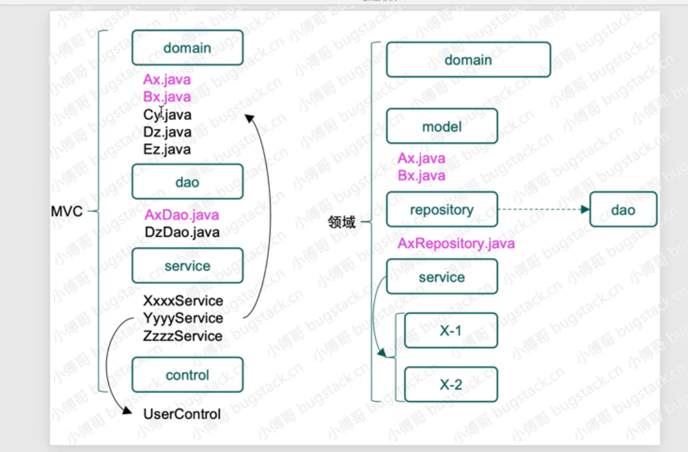


关于这个分层可以看下， AD钙 的一个理解， 他在 这一节的 学习过程中， 总结了相关的 MVC 和DDD 的区别和相似之处

读完之后，还是收获蛮多的！


== 2.  抽奖算法的铺垫


- 斐波那契散列算法， 其实主要的就是 ， 黄金分割比  的利用

```java

    public static void main(String[] args) {
        long l1 = (long) ((1L << 32) * (Math.sqrt(5) - 1)/2);
        System.out.println("as 32 bit unsigned: " + l1);
        int i1 = (int) l1;
        System.out.println("as 32 bit signed:   " + i1);
        System.out.println("MAGIC = " + 0x61c88647);

        // 下面和上面的 输出是一样的！
        System.out.println((1L << 32) - (long) ((1L << 32) * (Math.sqrt(5) - 1))/2);
    }

输出结果:
as 32 bit unsigned: 2654435769
as 32 bit signed:   -1640531527
MAGIC = 1640531527
1640531527


```


- 那么 请问一下这种算法的缺点是什么呢?

- 这里还对该算法进行了测试, 在所给的 这个   private final int RATE_TUPLE_LENGTH = 128;  (这个 散列想过确实猛!)

完成散列. 不会出现任何的重复现象!


```java
   // 测试的代码
   
   Set<Integer> set = new HashSet<>();

        for(int i = 1;i <= 100;i++){
//            System.out.print(hashIdx(i) + "  ");
            if(set.contains(hashIdx(i))){
                System.out.println(hashIdx(i));
            }
            set.add(hashIdx(i));
        }

        System.out.println(set.size());

    }
    static  int hashIdx(int val) {
        int hashCode = val * HASH_INCREMENT + HASH_INCREMENT;
        return hashCode & (RATE_TUPLE_LENGTH - 1);
    }
    
    
    
```


- ThreadLocal 中使用的  就是 斐波那契散列算法

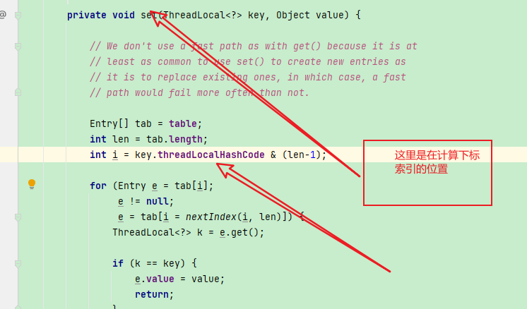

然后

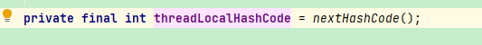

then


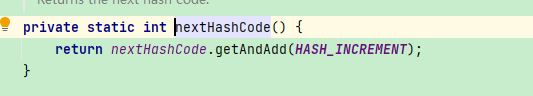


一些关键的变量

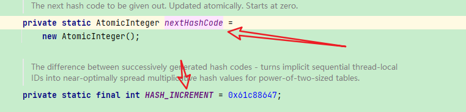

注意这里是  atomic 整数, 线程安全的 (底层采用CAS)

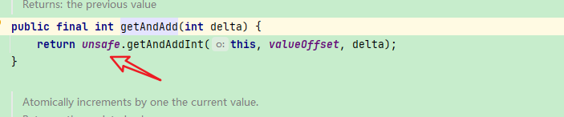


== 3.  实现


这里大多使用的都是 线程 安全的一些操作

1. 比如 map 使用的 是 ConcurrentHashMap

这里使用了一个 新的api，  ConcurrentHashMap 也一样的， 只不过是线程安全的而已！

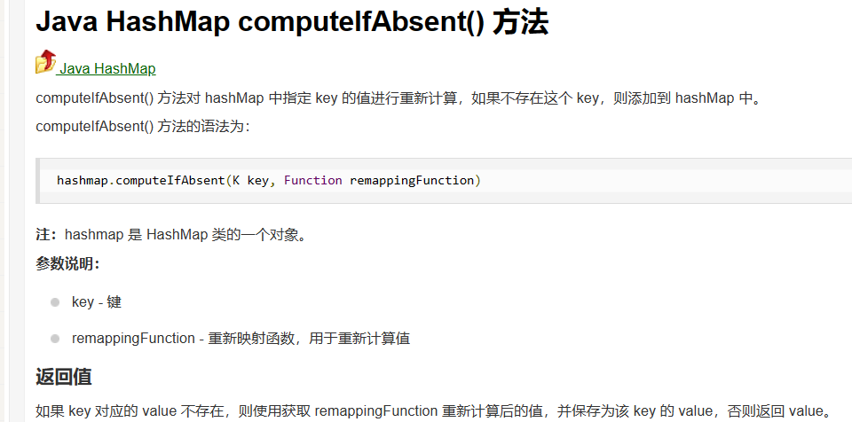


2. Random 使用的是   SecureRandom （注意看一下 ， 这个 的一个安全操作是什么！）


3. BigDecimal 这个类的一些新的使用


注意这个类也好像是不可变类， 每一次的操作都会产生一个新的 BigDecimal对象


```java
  public static void main(String[] args) {

        double a = 1.4341;

        BigDecimal bigDecimal = new BigDecimal(a);
        System.out.println(bigDecimal.setScale(3, RoundingMode.UP));

    }
==
    输出 1.435


== 
public BigDecimal setScale(int newScale, RoundingMode roundingMode) {
        return setScale(newScale, roundingMode.oldMode);
    }


==
    ROUND_UP
进位制：不管保留数字后面是大是小 (0 除外) 都会进 1。结果会向原点的反方向对齐，正数向正无穷方向对齐，负数向负无穷方向对齐。

这里的scale 是保留的位数, 0  是不会进一的,注意这一点!


```


- 等下实现的时候, 注意下这个点:

bigDecimal, 有一点小小的问题在里面!


- 整体概率

注意一下这里是怎么 把 概率进行一个重新分配, 其实 就是 根据排除后的 概率和 重新计算!


- 单向概率


断言判断

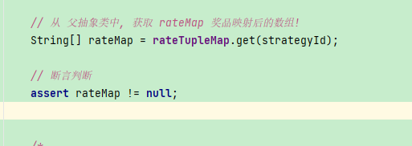


